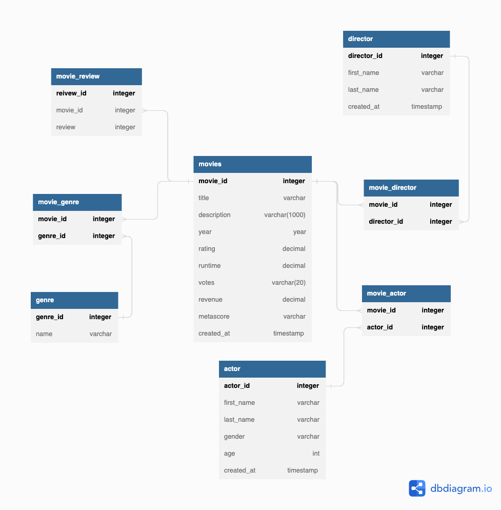

# movies-rest-api
**Date - 05/04/24**

**movieor - Jeet Soni**

---

[](https://github.com/pylint-dev/pylint)


[](https://pytest.org)

[](https://github.com/psf/black)


## Description

Taking it step by step, and now combining all the pieces I've learned – from understanding ER-diagrams to actually building the API – I'm excited to present my first CRUD (create, read, update, delete) Rest-API using Python Flask. This API is designed specifically for managing movie data and effortlessly retrieves information from the database.

## Tech Stack:

* **Web Framework**: Flask
* **Database**: PostgresSQL
* **Parsing/Validation**: Pydantic
* **Unit Tests**: PyTest
* **Linting**: Black and Pylint

## ER-Diagram

Here's an overview of the movies database setup



## RESTful Endpoints

### Movie

| Endpoint | HTTP Method | Result |
|:---|:---:|---|
| `/movie/movies`  | `GET`  | Gets all movies  |
| `/movie/{movie_id}`  | `GET`  | Gets an movie by ID  |
| `/movie/create`  | `POST`  | create a new movie  |
| `/movie/{movie_id}`  | `PUT`  | Updates an movie record by ID |
| `/movie/{movie_id}`  | `DELETE`  | Deletes an movie record by ID |
| `/movie/like`  | `POST`  | Returns all record with specified  pattern    |
| `/movie/{exact}`  | `POST`  | Returns all records with exact match  |
| `/movie/{in}`  | `POST`  | Returns multiple records with specified multiple values  |


### Actor

| Endpoint | HTTP Method | Result |
|:---|:---:|---|
| `/actor/actors`  | `GET`  | Gets all actors  |
| `/actor/{actor_id}`  | `GET`  | Gets an actor by ID  |
| `/actor/create`  | `POST`  | create a new actor  |
| `/actor/{actor_id}`  | `PUT`  | Updates an actor record by ID |
| `/actor/{actor_id}`  | `DELETE`  | Deletes an actor record by ID |
| `/actor/like`  | `POST`  | Returns all record with specified  pattern    |
| `/actor/{exact}`  | `POST`  | Returns all records with exact match  |
| `/actor/{in}`  | `POST`  | Returns multiple records with specified multiple values  |


### Director

| Endpoint | HTTP Method | Result |
|:---|:---:|---|
| `/director/directors`  | `GET`  | Gets all directors  |
| `/director/{director_id}`  | `GET`  | Gets an director by ID  |
| `/director/create`  | `POST`  | create a new director  |
| `/director/{director_id}`  | `PUT`  | Updates an director record by ID |
| `/director/{director_id}`  | `DELETE`  | Deletes an director record by ID |
| `/director/like`  | `POST`  | Returns all record with specified  pattern    |
| `/director/{exact}`  | `POST`  | Returns all records with exact match  |
| `/director/{in}`  | `POST`  | Returns multiple records with specified multiple values  |

### Genre

| Endpoint | HTTP Method | Result |
|:---|:---:|---|
| `/genre/genres`  | `GET`  | Gets all genres  |
| `/genre/{genre_id}`  | `GET`  | Gets an genre by ID  |
| `/genre/create`  | `POST`  | create a new genre  |
| `/genre/{genre_id}`  | `PUT`  | Updates an genre record by ID |
| `/genre/{genre_id}`  | `DELETE`  | Deletes an genre record by ID |
| `/genre/like`  | `POST`  | Returns all record with specified  pattern    |
| `/genre/{exact}`  | `POST`  | Returns all records with exact match  |
| `/genre/{in}`  | `POST`  | Returns multiple records with specified multiple values  |


### movie_actor

| Endpoint | HTTP Method | Result |
|:---|:---:|---|
| `/movie_actor/movie_actors`  | `GET`  | Gets all movie_actors  |
| `/movie_actor/{movie_id}{actor_id}`  | `GET`  | Gets an actor by ID  |
| `/movie_actor/create`  | `POST`  | create a new movie_actor  |
| `/movie_actor/{movie_id}{actor_id}`  | `PUT`  | Updates an movie_actor record by ID |
| `/movie_actor/{movie_id}{actor_id}`  | `DELETE`  | Deletes an movie_actor record by ID |
| `/movie_actor/{exact}`  | `POST`  | Returns all records with exact match  |


### movie_director

| Endpoint | HTTP Method | Result |
|:---|:---:|---|
| `/movie_director/movie_directors`  | `GET`  | Gets all movie_directors  |
| `/movie_director/{movie_id}{director_id}`  | `GET`  | Gets an actor by ID  |
| `/movie_director/create`  | `POST`  | create a new movie_director  |
| `/movie_director/{movie_id}{director_id}`  | `PUT`  | Updates an movie_director record by ID |
| `/movie_director/{movie_id}{director_id}`  | `DELETE`  | Deletes an movie_director record by ID |
| `/movie_director/{exact}`  | `POST`  | Returns all records with exact match  |


### movie_genre

| Endpoint | HTTP Method | Result |
|:---|:---:|---|
| `/movie_genre/movie_genres`  | `GET`  | Gets all movie_genres  |
| `/movie_genre/{movie_id}{genre_id}`  | `GET`  | Gets an actor by ID  |
| `/movie_genre/create`  | `POST`  | create a new movie_genre  |
| `/movie_genre/{movie_id}{genre_id}`  | `PUT`  | Updates an movie_genre record by ID |
| `/movie_genre/{movie_id}{genre_id}`  | `DELETE`  | Deletes an movie_genre record by ID |
| `/movie_genre/{exact}`  | `POST`  | Returns all records with exact match  |


### movie_review

| Endpoint | HTTP Method | Result |
|:---|:---:|---|
| `/movie_review/movie_reviews`  | `GET`  | Gets all movie_reviews  |
| `/movie_review/{movie_id}{review_id}`  | `GET`  | Gets an movie_review by ID  |
| `/movie_review/create`  | `POST`  | create a new movie_review  |
| `/movie_review/{review_id}`  | `PUT`  | Updates an movie_review record by ID |
| `/movie_review/{review_id}`  | `DELETE`  | Deletes an movie_review record by ID |
| `/movie_review/{exact}`  | `POST`  | Returns all records with exact match  |
| `/movie_review/{in}`  | `POST`  | Returns multiple records with specified multiple values  |

## Run the project

To turn on the API simple run:

```$ . ./flaskenv.sh```


## Testing

To ensure that the API runs smoothy as expected, I have used PyTest to test all my endpoints.

**NOTE: Ensure you are in virtual environment, if not run the command above** 

```$ pytest tests/```


